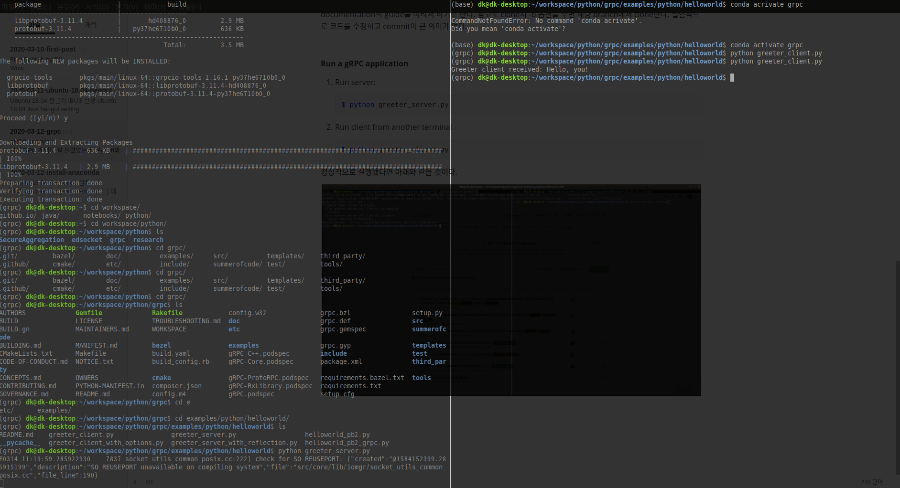
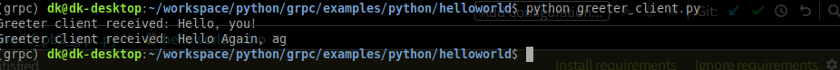

# gRPC Overview

사실 RPC 개념도 잘 몰랐었는데, PySyft와 TF-Federated를 좀 훑어보다가 gRPC에 급 꽂혀서 당분간 사용해보고 익히려고 한다. 구글이 개발한 RPC다! 라는 내용 같은 거는 구글에 찾으면 많이 나올테니 당장 사용부터 해보기로 했다.

참고) RPC : Remote Procedure Call, 원격으로 함수를 불러 로컬에 있는 것처럼 쓸 수 있게 하는 시스템이다라는 정도만 일단 알아두고, 추후에 개념을 계속 공부하면서 자세히 포스팅 할 듯 하다.

### Python Quick Start

[gRPC 공식페이지](https://grpc.io/)에 있는 document를 기반으로 작성했다.

나는 conda환경을 쓸 것이기 때문에 conda를 쓰겠지만 하나 불편한게 conda-forge에 없는 것들은 아마 그대로 `pip`를 통해 진행할 것 이다.

##### Make conda environment

```bash
$ conda create -n grpc python=3.7
$ conda activate grpc
```


##### Install gRPC

```bash
$ conda install grpcio -c conda-forge
$ conda list #or pip list
```

여기 까지하면 grpcio는 설치되었다.


##### Install gRPC Tools

gRPC에는 protocol buffer라고 하여 .proto로 된 파일을 작성하고 컴파일해야 한다. 이 말은 즉 .proto가 바뀌면 해당 프로토 파일이 적용된 것들을 다시 구성해야된다는 말이기도 한 듯 하다. 어찌됐든 개인적으로 .proto를 만들어야 할 것 이므로 설치한다.

```bash
$ conda install grpcio-tools -c conda-forge
```


##### Download the example

개인적인 사용에 앞서 example을 수행해보는 것은 아주 중요하다고 생각한다. 

```bash
$ git clone -b v1.27.2 https://github.com/grpc/grpc
$ cd grpc/examples/python/helloworld
```

helloworld라니. python 버전의 grpc는 1.27.2가 최신인듯 하다. C++에서 쓴다 하면 1.27.3이 최신으로 나오는데, 그냥 documentation의 guide를 따라서 하기로 한다. 참고로 clone시 -b 옵션을 주면 해당 branch에서 clone한다. 실험적으로 코드를 수정하고 commit이 큰 의미가 없다.


##### Run a gRPC application

1. Run server:

   ```bash
   $ python greeter_server.py
   ```

2. Run client from another terminal

   ```bash
   $ python greeter_client.py
   ```


정상적으로 실행됐다면 아래와 같을 것이다. 이로써 간단한 클라이언트-서버간 gRPC 통신 애플리케이션 예제를 돌려봤다.




##### Update a gRPC service

Protobuf에 대해서는 본 포스팅 쓰는 시점에서 전혀 무지한 상태지만, 예제를 통해 간단히 맛보는 느낌으로 계속해서 진행하기로 한다. 우리는 흔히 Json형식에는 익숙하다. 그도 그럴 것이, Json 데이터는 우리가 읽을 수 있다. 그러나 흔히 protocol buffer의 데이터는 .proto파일을 옆에 두지 않고서는 당최 이해불가다. 원리에 대해 좀 알 필요가 있다. 이후에도 [이곳](https://jeong-pro.tistory.com/190)을 참고하며 공부하겠지만 미리 한번 봐두는 것도 좋다.


위에서 받은 git repo에서 `examples/protos` 에 보면 `helloworld.proto`가 있다. Vim 이든 기타 에디터든 열어보면 어떻게 정의되어 있는지 살펴볼 수 있다.

```protobuf
syntax = "proto3";

option java_multiple_files = true;
option java_package = "io.grpc.examples.helloworld";
option java_outer_classname = "HelloWorldProto";
option objc_class_prefix = "HLW";

package helloworld;

// The greeting service definition.
service Greeter {
  // Sends a greeting
  rpc SayHello (HelloRequest) returns (HelloReply) {}
  
}

// The request message containing the user's name.
message HelloRequest {
  string name = 1;
}

// The response message containing the greetings
message HelloReply {
  string message = 1;
}
```

protobuf가 md파일 인터프리터로 존재하는 걸 보면 gRPC라는게 대단하긴 한가보다.


자 이제 이 파일을 마음껏 수정해도 remote 레포에 아무 영향 없을 것이기 때문에 가이드대로 수정해본다.

```protobuf
syntax = "proto3";

option java_multiple_files = true;
option java_package = "io.grpc.examples.helloworld";
option java_outer_classname = "HelloWorldProto";
option objc_class_prefix = "HLW";

package helloworld;

// The greeting service definition.
service Greeter {
  // Sends a greeting
  rpc SayHello (HelloRequest) returns (HelloReply) {}
  // Added another example line
  rpc SayHelloAgain (HelloREquest) returns (HelloReply) {}
}

// The request message containing the user's name.
message HelloRequest {
  string name = 1;
}

// The response message containing the greetings
message HelloReply {
  string message = 1;
}
```

이러고 다음 라인을 실행하면 두 가지 파일이 바뀌어있다. examples/python/helloworld 폴더를 기준으로 path를 넣었으므로 위 폴더에서 실행하자.

```bash
$ python -m grpc_tools.protoc -I ../../protos --python_out=. --grpc_python_out=. ../../protos/helloworld.proto
```

바뀐 두 파일은 `helloworld_pb2.py` 와 `helloworld_pb2_grpc.py`다.  뭔가가 추가됐는데  아직 이해 못하겠으니 그냥 우리가 바꾼 부분에 대해 뭐가 추가 됐구나라고  생각하고 넘어간다.

이제 `greeter_server.py`와 `greeter_client.py` 에 우리가 아까 추가한 SayHelloAgain에 대한 몇 가지 라인을 추가한다.

```python
class Greeter(helloworld_pb2_grpc.GreeterServicer):

  def SayHello(self, request, context):
    return helloworld_pb2.HelloReply(message='Hello, %s!' % request.name)

  def SayHelloAgain(self, request, context):
    return helloworld_pb2.HelloReply(message='Hello again, %s!' % request.name)
...
```

```python
def run():
    # NOTE(gRPC Python Team): .close() is possible on a channel and should be
    # used in circumstances in which the with statement does not fit the needs
    # of the code.
    with grpc.insecure_channel('localhost:50051') as channel:
        stub = helloworld_pb2_grpc.GreeterStub(channel)
        response = stub.SayHello(helloworld_pb2.HelloRequest(name='you'))
        print("Greeter client received: " + response.message)
        response = stub.SayHelloAgain(helloworld_pb2.HelloRequest(name='ag'))
        print("Greeter client received: " + response.message)
```

이제 다시 실행해보면 !?



새로 정의한 함수에 대한 라인이 찍히는 걸 볼 수있다.


### Summary

간략히 위에 우리가 뭘했는지 정리해보자면, `.proto`를 통해 우리가 주고 받을 데이터에 대한 정의를 내렸다. 이를 기반으로 통신 코드를 생성하고  `greeter_server.py`와 `greeter_client.py`에 해당 메세지에 대한 내용을 주고 받는 메소드를 추가했다. 

사실 Flask가지고 개발하기가 더 편할지도 모르겠다. 그런데 많은 프로젝트들이 grpc를 쓰고있고, 그걸 이해하려다보니 공부하게됐다. 하나씩 익혀나가면서 왜 이걸 쓰는지도 몸소 경험해보고, 앞으로 개발할 프로젝트에 가능하면 gRPC 를 쓸 수 있는 능력을 갖추게 되기를 !


