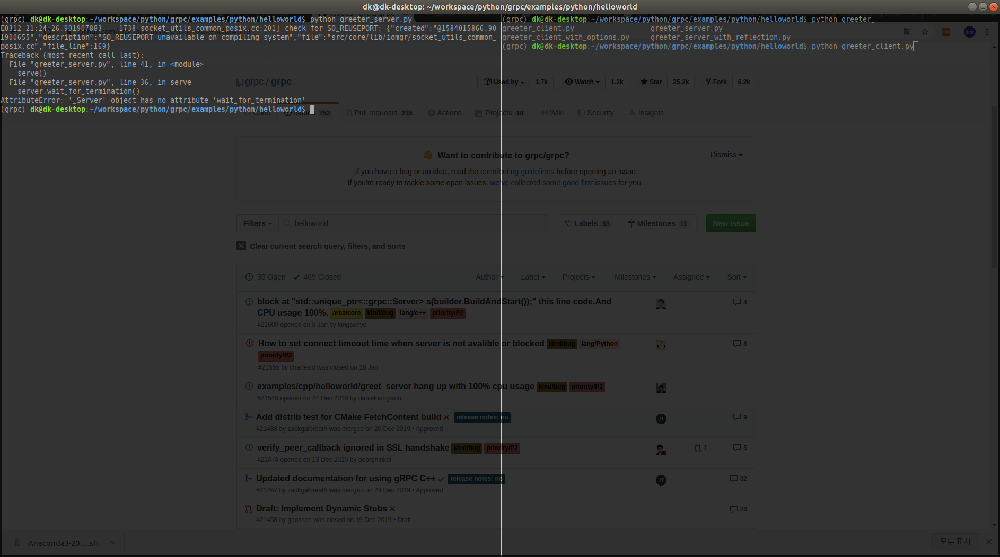

# gRPC Overview

사실 RPC 개념도 잘 몰랐었는데, PySyft와 TF-Federated를 좀 훑어보다가 gRPC에 급 꽂혀서 당분간 사용해보고 익히려고 한다. 구글이 개발한 RPC다! 라는 내용 같은 거는 구글에 찾으면 많이 나올테니 당장 사용부터 해보기로 했다.

참고) RPC : Remote Procedure Call, 원격으로 함수를 불러 로컬에 있는 것처럼 쓸 수 있게 하는 시스템이다라는 정도만 일단 알아두고, 추후에 개념을 계속 공부하면서 자세히 포스팅 할 듯 하다.

### Python Quick Start

[gRPC 공식페이지](https://grpc.io/)에 있는 document를 기반으로 작성했다.

나는 conda환경을 쓸 것이기 때문에 conda를 쓰겠지만 하나 불편한게 conda-forge에 없는 것들은 아마 그대로 `pip`를 통해 진행할 것 이다.

##### Make conda environment

```bash
$ conda create -n grpc python=3.7
$ conda activate grpc
```


##### Install gRPC

```bash
$ conda install grpcio -c conda-forge
$ conda list #or pip list
```

여기 까지하면 grpcio는 설치되었다.


##### Install gRPC Tools

gRPC에는 protocol buffer라고 하여 .proto로 된 파일을 작성하고 컴파일해야 한다. 이 말은 즉 .proto가 바뀌면 해당 프로토 파일이 적용된 것들을 다시 구성해야된다는 말이기도 한 듯 하다. 어찌됐든 개인적으로 .proto를 만들어야 할 것 이므로 설치한다.

```bash
$ conda install grpcio-tools -c conda-forge
```


##### Download the example

개인적인 사용에 앞서 example을 수행해보는 것은 아주 중요하다고 생각한다. 

```bash
$ git clone -b v1.27.2 https://github.com/grpc/grpc
$ cd grpc/examples/python/helloworld
```

helloworld라니. python 버전의 grpc는 1.27.2가 최신인듯 하다. C++에서 쓴다 하면 1.27.3이 최신으로 나오는데, 그냥 documentation의 guide를 따라서 하기로 한다. 참고로 clone시 -b 옵션을 주면 해당 branch에서 clone한다. 실험적으로 코드를 수정하고 commit이 큰 의미가 없다.


##### Run a gRPC application

1. Run server:

   ```bash
   $ python greeter_server.py
   ```

2. Run client from another terminal

   ```bash
   $ python greeter_client.py
   ```

   

client terminal까지 딱 준비했는데, 바로 에러가 나면서 안된다.




