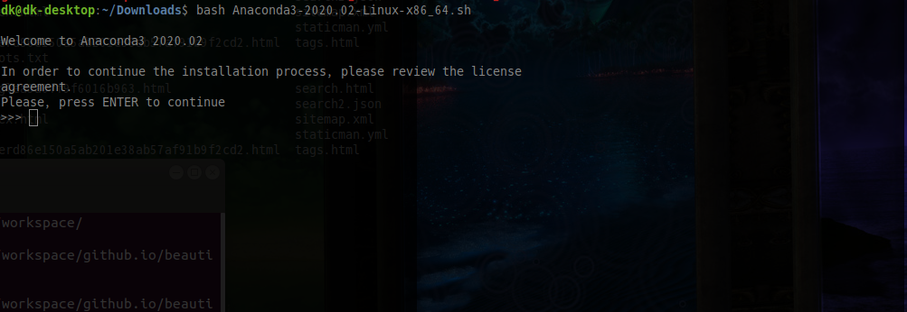

# Ubuntu 18.04 Anaconda 설치

원래 Virtualenv ( python-venv 아님. ) 에 익숙해져있다가 최근 conda를 접했다. Docker나 Virtualenv 외에도 나름 일관된 가상환경을 제공하는데에 좋아보였다. 윈도우 환경에서 아나콘다를 많이 쓰기도 하고, 환경을 `.yml`로 만들어 다시 재구축하는 부분이 일단 마음에 들었다.

그러나 github에서 직접 땡기는 패키지의 경우 conda-forge같은 곳에 없으면 yml파일을 수작업으로 업데이트 해야하는 듯 하다. 역시 장점이 있으면 단점이 있긴하다. 어쨌든 앞으로 우분투 환경에 아나콘다를 설치해서 사용할 예정이다.

### Installation

1. [아나콘다 홈페이지](https://www.anaconda.com/distribution/)로 접속하여 [다운로드 페이지](https://www.anaconda.com/distribution/#download-section)로 들어간다. 

2. 아마도(?) 쓰고 싶은 Python 버전을 고르는 듯하다. 버전을 선택하여 Download 버튼을 누르면 다운로드 폴더에 `Anaconda3-yyyy.mm-Linux-x86_64.sh` 형식의 쉘파일이 받아진다. 

3. 두 번째줄 결과가 받은 파일 이름과 같으면 설치를 진행한다.

   ```bash
   cd ~/Downloads
   sha256sum Anaconda3-2020.02-Linux-x86_64.sh
   
   bash Anaconda3-2020.02-Linux-x86_64.sh
   ```

4. 아래와 같은 화면을 시작으로 몇 가지 스텝이 나온다.

   

   처음엔 라이센스 읽으라고 해서 엔터를 쳐서 끝까지 가면 된다.

   이후에 YES를 치고 넘어가다 보면 설치 폴더가 나오는데,  보통 홈 디렉토리의 anacondaX 형식의 폴더에 설치되고, 환경변수도 모두 설정해준다. 

   initialize 까지 인스톨러가 해준다고 하니 모두 YES로 진행하면 무리없이 진행된다.

5. 그 후 아래 명령을 치면 마무리 된다.

   ```bash
   source ~/.bashrc
   ```

   아마 이 후 CTRL+ALT+T 등으로 터미널을 열면 아마 맨 앞에 (base)라는 prefix가 계속 붙어있을 것이다. 이게 가상환경의 이름이기도 하며 추후에 생성하는 환경이름에 따라 바뀔 것이다.

6.  ```bash
   conda info --envs
   conda create -n env_name python=3.7
   conda env remove -n env_name
    ```

   위 명령으로 간단히 현재 만들어진 가상환경들을 보고 가상환경을 만들고 지울 수 있다.

   만든후에는 `conda activate env_name` 으로 활성시키고 비활성화는 `conda deactivate` 로 하면 된다.

7. 추가적으로 자신이 만든 환경을 yml 파일로 export 해놓고 다시 이를 바탕으로 환경 구축이 가능한데, 자세한 내용은 다음 [링크](https://hiseon.me/python/anaconda-env-export/)에서 확인하면 된다. 구글에 conda export로 검색하면 방법은 여기 저기 나와있다.

   (링크 깨질 것을 대비해 사실 해당 포스트에 일일이 작성하는게 맞으나.. 스크린샷 찍는 것이 귀찮아 링크로 남긴다.)

